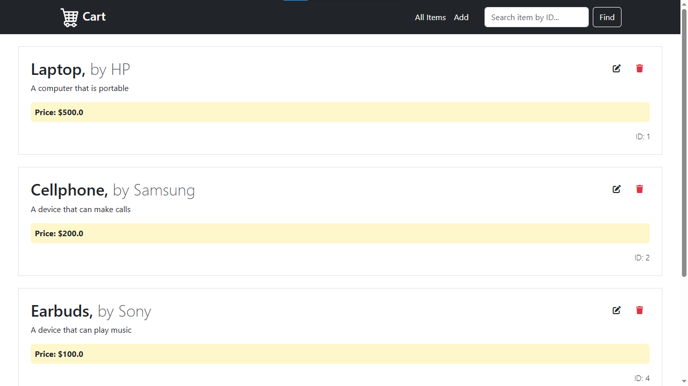
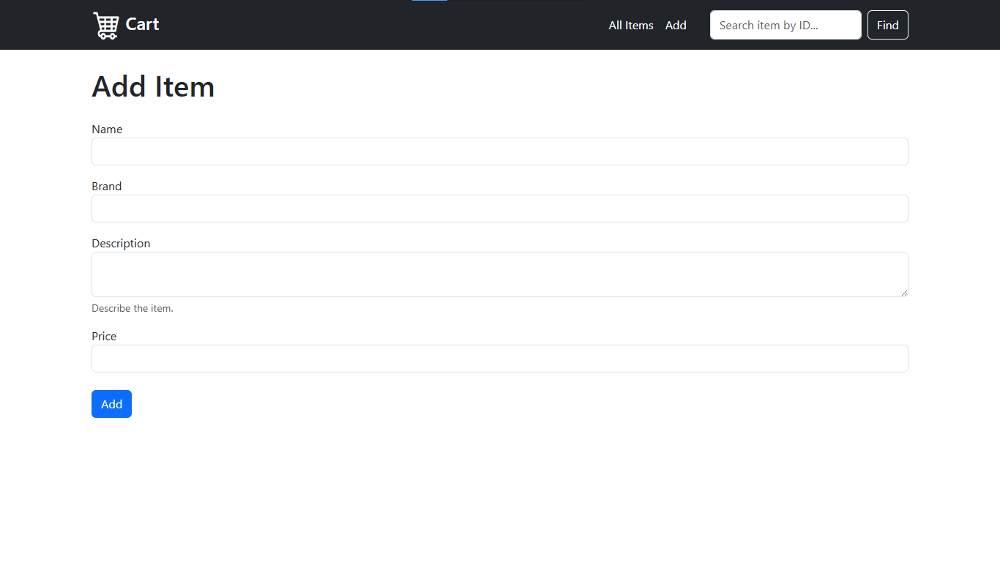
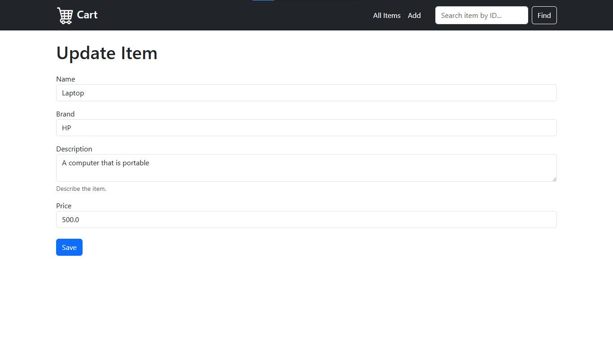

# Cart

 
 

## Features

- **FastAPI Framework**: High-performance API built with FastAPI.
- **Jinja2 Templates**: Server-side rendering with Jinja2.
- **CRUD Operations**: Create, read, update, and delete items in cart.
- **Static File Serving**: Easily serve assets including CSS, JavaScript, and images via FastAPI.

## Screenshots

<div style="display:flex; justify-content: space-around;">
   
   
   
</div>

## Setup

1. **Clone the repository:**
   ```bash
   git clone https://github.com/akshay-rajan/cart.git
   cd cart
   ```

2. **Create a virtual environment:**
   ```bash
   python -m venv venv
   ```

3. **Activate the virtual environment:**

    On Windows:
    ```bash
    venv\Scripts\activate
    ```

    On macOS/Linux:
    ```bash
    source venv/bin/activate
    ```

4. **Install dependencies:**
   
   ```bash
   pip install -r requirements.txt
   ```

5. **Run the application:**
   
   ```bash
   uvicorn main:app --reload
   ```

## Project Structure

```
|- main.py -- Main FastAPI application.
|- models.py -- Data models for items.
|- database.py -- In-memory database of items.
|- templates/ -- Jinja2 HTML templates.
|- static/ -- Static assets (CSS, images).
```
